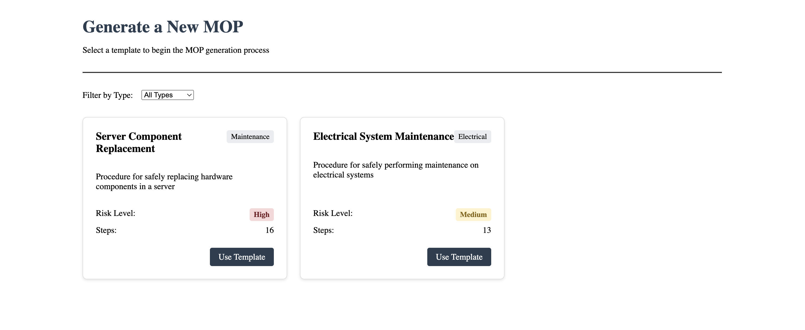
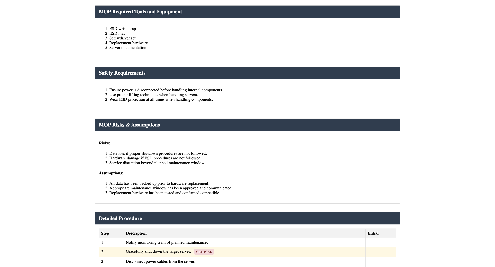
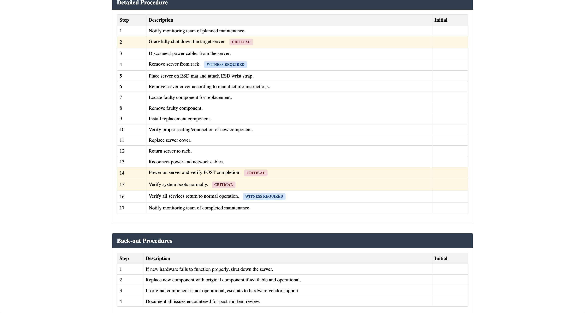

# MOP Generator (Pilot)

A platform for generating, managing, and executing Method of Procedure (MOP) documents for data center operations. This application streamlines the process of creating standardized operational procedures for critical infrastructure tasks.

### Cover Page


### Generate Page


### MOP Example






## Features

- **Browse & View MOPs**: Access a library of standardized procedure documents (filter by type)
- **Generate MOPs from Templates**: Guided interface for creating new MOPs from pre-defined templates with custom fields

## Tech Stack

### Frontend
- **Svelte (SvelteKit)**
- **TypeScript**

### Backend
- **Node.js**
- **Express**
- **TypeScript**

### Data Storage
- **JSON Files**: Simple file-based storage (Level 1)
- *Future: Database integration planned for Level 2*

## Project Structure

```
mop-generator/
├── assets/                # Images
├── client/                # SvelteKit frontend
│   ├── src/
│   │   ├── lib/
│   │   │   ├── components/     # Reusable Svelte components
│   │   │   │   ├── FormField.svelte              # Renders the appropriate input type (text, select, etc.)
│   │   │   │   ├── FormSection.svelte            # Receives a section name, gets all fields (FormFields) for that section
│   │   │   │   ├── MopSection.svelte             # This is each section within the MOP
│   │   │   │   ├── MopViewer.svelte              # This is the complete MOP with multiple MopSections
│   │   │   │   └── TemplateInterface.svelte      # Maintains the overall form data, fetches template data, handles navigation
│   │   │   ├── models/         # TypeScript interfaces
│   │   │   │   ├── mop.model.ts
│   │   │   │   └── template.model.ts
│   │   │   └── services/       # API client services
│   │   │       ├── mop.service.ts
│   │   │       └── template.service.ts
│   │   └── routes/             # SvelteKit routes
│   │       ├── [id]/           # MOP detail page
│   │       │   ├── +page.svelte
│   │       │   └── +page.server.ts
│   │       ├── generate/       # MOP generation pages
│   │       │   ├── [id]/       # Template-specific generation
│   │       │   │   ├── +page.svelte
│   │       │   │   └── +page.server.ts
│   │       │   ├── +page.svelte
│   │       │   └── +page.server.ts
│   │       ├── +page.svelte    # Home page
│   │       └── +page.server.ts
│   ├── static/                 # Static assets
│   ├── package.json
│   ├── svelte.config.js
│   └── tsconfig.json
├── server/                # Express backend
│   ├── src/
│   │   ├── data/           # JSON data storage
│   │   │   ├── mops.json   # Sample MOP data
│   │   │   └── templates.json  # MOP templates
│   │   ├── models/         # TypeScript interfaces
│   │   │   ├── mop.model.ts
│   │   │   └── template.model.ts
│   │   ├── routes/         # API routes
│   │   │   ├── mop.routes.ts
│   │   │   └── template.routes.ts
│   │   ├── services/       # Business logic
│   │   │   ├── mop.service.ts
│   │   │   ├── template.service.ts
│   │   │   └── generator.service.ts
│   │   └── index.ts        # Entry point
│   ├── package.json
│   └── tsconfig.json
└── README.md              # This file
```

## Setup and Installation

### Prerequisites
- Node.js (v14+ recommended)
- npm or yarn

### Backend Setup

```bash
# Navigate to server directory
cd server

# Install dependencies
npm install

# Start development server
npm run dev
```

The backend API will be available at http://localhost:3000.

### Frontend Setup

```bash
# Navigate to client directory
cd client

# Install dependencies
npm install

# Start development server
npm run dev
```

The frontend will be available at http://localhost:5173.

## Implementation Details

This project implements a Method of Procedure (MOP) generator for data center operations, following a three-level approach:

### Level 1 (Basic - Implemented)
- ✅ Simple data model for MOP storage and retrieval
- ✅ Basic MOP viewing functionality
- ✅ Step-by-step procedure display
- ✅ Filtered browsing by operation type
- ✅ JSON-based data storage

### Level 2 (Intermediate - Partially Implemented)
- ✅ Template-based MOP generation
- ✅ Extended data model for multiple operation types
- ✅ Form template with validation
- ✅ Dynamic MOP preview
- ✅ Conditional procedure steps based on inputs
- 🔄 More robust AI-assisted generation (in progress)

### Level 3 (Advanced - Planned)
- AI-driven MOP generation
- Versioning and history tracking
- Compliance rule validation
- Continuous learning from feedback
- Role-based access control

## Usage

### Viewing MOPs
1. Navigate to the home page
2. Browse the list of available MOPs
3. Click on a MOP to view its details
4. Use the filter dropdown to find MOPs by type

### Generating a New MOP
1. Click "Generate New MOP" on the home page
2. Select a template for your operation type
3. Fill in the required information through the multi-step template
4. Preview the generated MOP
5. Click "Save MOP" to create and view the new procedure

## API Endpoints

### MOPs
- `GET /api/mops` - Get all MOPs
- `GET /api/mops/:id` - Get MOP by ID
- `GET /api/mops/types` - Get all MOP types
- `GET /api/mops/types/:type` - Get MOPs by type
- `POST /api/mops` - Create a new MOP
- `PUT /api/mops/:id` - Update a MOP
- `DELETE /api/mops/:id` - Delete a MOP

### Templates
- `GET /api/templates` - Get all templates
- `GET /api/templates/:id` - Get template by ID
- `GET /api/templates/types` - Get all template types
- `GET /api/templates/types/:type` - Get templates by type
- `POST /api/templates/:id/generate` - Generate a MOP from a template

## Future Enhancements

### Level 2 Enhancements (In Progress)
- Database integration (MongoDB or PostgreSQL)
- Enhanced validation rules for MOP generation
- User accounts and authentication
- Improved template management

### Level 3 Enhancements (Planned)
- AI-assisted MOP refinement
- Version control for MOPs
- Compliance checking against industry standards
- Feedback and learning system
- Mobile app for field use

## Acknowledgments

- Claude generated the examples for MOPs and templates (in `data.json` and `template.json`) since I have limited field knowledge of what MOPs to add or what the steps for each MOP are`
